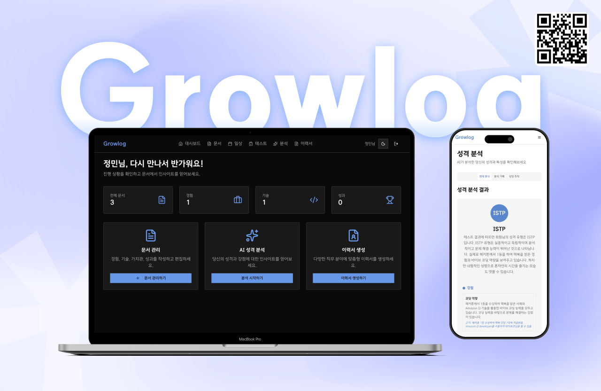

+++
date = '2025-09-07T18:24:14+09:00'
title = 'AMAZON Q 해커톤 회고'
tags=["AWS","해커톤", "회고"]
categories=["일반"]
+++


(이름은 제 이름이 아니에요)

9/5 ~ 9/6 에 진행한 [Amazon Q Developer 해커톤](https://qhackathon2025.site/)에 다녀왔어요.
9/5는 온라인 진행이라 [튜링의사과](https://turingapple.com/)에서 모여서 진행했고, 9/6에는 AWS 사옥에서 오프라인으로 진행했어요.

튜링의 사과가 정말 좋았어요. 오픈채팅에서 이야기만 들어보다가 실제로 가보니까 정말 좋은 장소였어요. 자리마다 4K 모니터가 달려있고 기계식 키보드 사용가능한데다가 의자도 편했어요. 취업 성공하면 자주 가보고 싶어요.

## 시작 한 시간 전까지 정해진게 없었어요

선착순으로 참가자를 모집했기때문에, 주말까지 메일이 안오길래 사실 떨어진줄 알고 있었어요.

화요일 새벽 두시 정도에 참가 확정됐다고 메일이 왔던걸로 기억하는데, 팀원들 모두 바빠서 미리 뭘 따로 공부하거나 합을 미리 맞출 시간이 없었고 주제도 못 정한 상태였어요. 저는 서울이랑 먼 곳에 살아서, 목요일에 서울 올라가고 저녁에 바이브코딩 관련 영상 세 네개 정도 찾아보고 잤던 것 같아요.

## 바이브코딩으로 구현한 첫 프로젝트, 내가 실제로 마주한 문제를 해결할려고 시도한 첫 프로젝트

지금까지는 인공지능을 사용하더라도, 모든 코드를 다 인공지능으로 짤려고 하지 않았어요. 왜냐하면 공부하는 과정이었고(학교, 부트캠프), 모든 코드를 인공지능으로 생성해서 사용할 돈도 없었구요.

토큰을 아예 생각하지 않고 프로젝트를 만들어 볼 수 있는 기회라 많이 설렜어요.

금요일 오전 9시에 튜링의사과 근처 블루보틀에서 주제를 정했는데, 부트캠프가 끝난지 2주가 되어가던 시점이라 이력서 작성에 대한 니즈가 모두에게 있었어요.
이력서를 작성하면서 내가 회사랑 fit이 맞는지 알기 위해서(혹은 회사에 어필하기 위해서) 나 자신을 알아야 한다는 생각을 하셨을거에요.
그 부분에서 착안을 해서, 1. 내가 어떤 사람인지 알 수 있고 그를 바탕으로 성장할 수 있는 개인 성장 플랫폼, 2. 입력된 정보를 바탕으로 이력서를 생성해주는 프로젝트를 만들려고 주제를 정했어요.

상의했던 주제 세 가지 중 저희랑 가장 밀접한 주제인 것 같아서 선택하게 되었어요.

지금까지 만든 프로젝트중에서는 실제로 제가 겪는 문제를 해결하는 과정을 담은 프로젝트가 없었기 때문에, 이번 경험이 기억에 많이 남을 것 같아요.

## 구현 전략과 목표

모든 것(98% 이상)을 Amazon Q를 사용해서 구현하고 실행하는게 목표였어요.

### 심사기준

- Amazon Q Developer 활용도 및 창의성(35점)
- 비즈니스 가치 및 실용성(30점)
- 기술적 구현 완성도(20점)
- 발표 및 데모(15점)

을 고려했을 때 **전 과정을 Q를 활용해서 구현한 실제로 사용할 수 있는 프로토타입을 만들자!** 라는 게 설득력이 있을 것 같았어요.

- **최소한의 기능을 만들고 기존 베이스 바탕으로 확장해서 구현**하는 전략을 사용했어요.
  - 경험, 기술, 가치관, 성과 네 가지 요소를 등록해서 AI를 통해 이력서를 만들어주는 MCP를 처음에 만들었어요.
  - 일상기록, 기분추적, 성찰, 테스트결과 네 가지 부분을 추가해서 입력할 수 있는 데이터를 확장하고, 표시하는 결과도 확장했어요. (이력서 생성 -> 자기성찰 부분으로 기능 확장)
- **기획 단계부터 Q를 사용해서 구체화**했어요
  - 저희가 정한 최소 요건(프로젝트 주제, 시간, 인원수, 프론트엔드 스택 - Nextjs, tailwind v4, shadcn)을 알려주고, 계획을 세우는 데 필요한 부분이 있으면 물어보라고 했어요.
  - spec 문서를 만들었어요.
  - spec에 따라 구현하기 위해서 어떤 식으로 실행을 해야하는지에 대한 plan을 만들었어요.
  - 용어 문서를 만들어서 프론트와 백엔드에서 사용하는 용어를 통일할려는 시도를 했어요.
  - frontend guide, backend guide 문서를 만들었어요.
- **항상 docs 폴더를 참조하고, 어떤 일을 해야하는지 Q가 판단하고 실행**하도록 했어요.
  - task가 달라지면 항상 새 탭을 열어서 작업할려고 했어요(컨텍스트 초기화)
  - 새 창을 열면 Q가 이전 진행상황을 모르기 때문에, docs 폴더를 만들고 @docs 를 사용해서 쿼리 날리기 전에 정보를 제공했어요.
  - 프로젝트 진행 상황 문서를 참고해서, 어떤 일을 해야 하는지 계획을 알게 만들고, 실행했어요.
- **최대한 문서를 영어로 작성**할려고 했어요.
  - 한글이 영어보다 컨텍스트를 두배 이상 차지한다는 정보를, 전날 영상보면서 알게 되었어요.
  - Q가 정보를 파악하는 데 당연히 적용될거라고 생각을 했고, 적용했어요.
  - task-list.md를 처음에 영어로 만들라는 지시를 까먹고 안넣어서 한글로 만들었는데, 팀원들끼리 소통하는데 한글로 소통하는게 편해서 유지했어요.
  - task-list 말고 다른 문서는 직접 보지 않을려고 했어요. 모든 과정을 Q를 통해서 진행하려고 시도했어요.
- **점진적으로 docs, rules를 업데이트** 했어요.
  - @docs를 항상 입력하는게 하다보니까 귀찮아져서, rule로 추가했어요.
  - @docs 업데이트를 안하게 되는 경우가 생겨서, 작업이 끝날때마다 업데이트하는 rule을 추가했어요.
  - 오류가 발생하면 오류를 수정하면서 오류가 왜 났는지 해명하게 시키고, 해당 내용을 rule로 업데이트하는 쿼리를 날리도록 팀 규칙을 정했어요.
  - 로그를 남기면 좀 도움이 될 것 같아서, 로그파일을 만드는 rule을 추가해서 시도했어요.
  - 영어 문서가 늘어나니까 대화할때도 영어를 사용해서, 문서 작성할때는 영어, 대화할때는 한글을 사용하도록 지시하는 rule을 만들었어요.
- **브랜치 생성, 커밋, 리베이스, PR** 까지 Q가 하도록 했어요.
  - 훅을 따로 만들지는 않고, 그때그때 쿼리를 입력했는데 훅을 만들었으면 더 좋았을 것 같아요.
- **전 과정을 Q가 진행하도록 하는 대신, 코드를 되돌리기 쉽게 하기 위해서 rebase를 활용한 git flow 전략을 채택**했어요.
  - 그래프를 최대한 선형으로 만들었어요.
  - 여기서 '최대한'이라는 단어를 사용한 이유는, 브랜치 규칙을 직접 만들지 않고, 그때그때 PR을 바로 합쳤기 때문이에요.

## 사용한 프롬프트

그때그때 기록해놓지 않아서 완전 정확하지는 않아요.

```
[기획 및 프로젝트 전반적인 계획 생성]
나에 대해 기록하고 그 내용을 바탕으로 이력서를 생성해 주는 서비스를 만들거야.
AMAZONQ를 최대한 활용하는 능력을 평가하는 하루동안 진행되는 AWS 해커톤에 참가한다고 가정하고,
필요한 내용을 나한테 물어봐줘.
Nextjs, tailwind v4, shadcn 사용하고 나머지 스택은 필요하면 물어봐줘.
```

```
[PR 생성]
새 브랜치를 만들어서 커밋하고, 최신 develop 브랜치 기준으로 rebase 한 뒤, pr 생성해서 올려줘
```

```
[서비스 확장]
## 서비스 개요, - “나를 기록하고, 탐구하고, 성장 과정을 시각화하여 자기인식과 커리어를 동시에 키우는 플랫폼”
...
나머지 내용(마크다운 형식으로 작성한 요구사항 입력)

지금 코드 베이스를 최대한 유지하면서 이 기획을 적용할 수 있는 계획을 세울거야.
필요한 내용을 물어봐줘.

(작업 후) @docs 문서를 이 내용에 따라 수정하고, 순서에 따라 계획 세워줘
```

```
[rule - 오류 발생했을 때]
오류 정보 오류 수정하고 왜 오류가 났는지 해명해. 오류 난 이유를 rule에 추가해줘
```

```
[rule - pr 올리기 전 로깅]
PR 올리기 전 docs/logs 아래에 로그 파일 생성해줘

[rule - pr 올리기 전 @docs 참고]
대답하기 전에 @docs를 먼저 읽는 규칙을 추가해줘

[rule - 작업 끝나고 @docs 문서 업데이트]
작업 끝나고 @docs 문서 업데이트해줘

[rule - @docs 수정]
기존에 한글로 생성된 문서 말고는 전부 영어로 작성해줘
```

## 성과

- 생성한 코드가 저희가 가장 많을 것 같아요.
  - 다른 팀들 레포를 확인했을 때, 보이는 커밋 수가 **100개** 정도였는데, 저희 팀의 최종 커밋 개수는 **200개**가 넘어가요.
  - 저희가 Q를 가장 많이 사용한 팀이 아니에요(시간 대비 효율적으로 코드를 생성했어요).
- 다른 팀들이랑 비교했을 때, 실제로 사용할 수 있는 프로젝트에 더 가까워요.
  - 다른 팀들이 만약에 글을 AI로 번역하는 프로젝트를 만든다고 한다면, 글을 입력하는 부분, 번역하는 부분, 결과를 출력하는 부분만 만들 거에요(예시).
  - 저희는 대시보드, 헤더, 랜딩페이지, 다크모드, 모바일 반응형, 스켈레톤, 로그인 로그아웃, 애니메이션, 토스트까지 전반적으로 사용할 수 있는 프로토타입을 만들었어요.
  - 비즈니스 가치 및 실용성을 제대로 판단할려면 실제로 사람들이 써 보고 평가해 볼 만한 프로젝트를 만들어야 한다고 생각했어요. 기술적 구현 완성도를 고려하더라도요.
  - 다만, 이 부분은 저희가 잘못 생각했던 것일수도 있어요. 실제로 수상하지 못했고, 수상한 프로젝트들을 포함해서 다른 팀들이 그렇게 만들지 않았으니까요.
- 아래부터는 Q가 평가한 지표에요.
- 처음 SPEC 문서와 마지막으로 생성한 코드를 비교해서 얼마만큼의 비용 이득이 있었는지 평가해달라고 했어요.
  - 매우 높은 효율성 지표: 단기간 고밀도 개발: 2일만에 완전한 플랫폼 구축
  - 높은 커밋 빈도
  - 체계적 문서화: 코드 대비 50% 문서화율
  - 모듈화된 구조: 108개 파일로 기능 분리
  - 개발 기간: 2일 (초단기)
  - 코드량: 338KB (중간 규모 플랫폼)
  - 기능 완성도: 95% (거의 완전한 플랫폼)
  - 문서화: 171KB (매우 체계적)
  - 시간당 생산성: 17-21KB/시간 (매우 높음)
  - 성공 요인: 기존 코드베이스 활용 + AI 도구 + 체계적 워크플로우 + 집중적 개발
- 기존 코드베이스를 활용해서 확장한 전략이 얼마만큼의 이득을 가져왔는지 평가해달라고 했어요.
  - 기존 코드베이스 활용 전략이 매우 성공적
  - 시간 투자: 54-72시간 (기존 40-53시간 + 확장 14-19시간)
  - 처음부터 개발 대비: 75-80% 시간 단축
  - 기능 확장: 단순 이력서 → 종합 자기성장 플랫폼
  - ROI: 200-300% 가치 증대
  - 핵심 성공 요인: 모듈화된 아키텍처 설계, AWS 서버리스 패턴 활용, 재사용 가능한 UI 컴포넌트, 확장 가능한 AI 프롬프트 시스템
  - 이는 기존 코드베이스를 전략적으로 활용한 매우 효율적인 개발 사례로 평가

## Amazon Q를 사용하면서 좋았던 점과 안좋았던 점(IDE 플러그인 기준)

- 배포를 굉장히 쉽고 편하게 할 수 있었어요. AWS 관련 지식이 많이 부족한 상태임에도 시간을 많이 들이지 않을 수 있었어요.
- MCP 서버를 설정해달라고 했을때, 직접 추가해주지 못했어요.
- URL을 클릭하면 이동할 수 있어야 하는데, 일일히 복사해서 붙여넣어야 했어요.
- 첫날 오후까지 줄바꿈이 되지 않았어요. 중간에 고쳐졌는데 언제 고쳐졌는지 모르겠어요.
- 완전 에이전틱하게 사용할 수 있는 설정이 없어요. 중간에 계속 일일히 클릭해야 해요.
- 중간에 오류가 잘 나지 않았는데, Q가 잘해서 오류가 나지 않은건지 SPEC 기반으로 사용해서 그런건지는 모르겠어요.
- 클로드를 사용하는데 3.5, 4.0 소넷밖에 지원하지 않아요.
- 토큰 양이 굉장히 많은 것 같았어요.
- 토큰이 얼마나 남았는지 표시해주지 않아요.
- 컨텍스트를 얼마나 쓰고있는지 80%가 되기 전에는 표시해주지 않아요.

## 아쉬웠던 점

- 수상하지 못했어요.
  - 4팀 안에 들지 못했어요.
  - 1등한 팀 제외하면 내가 어떻게 프로젝트를 진행했어야 저분들보다 잘할 수 있었을까? 에 대한 대답이 생각나지 않아요.
  - 1등한 팀을 제외하면 Amazon Q Developer 활용도 및 창의성 부분에서 'Q를 어떻게 잘 활용'하는지 평가하는것 보다, 'AWS 서비스'를 어떻게 잘 활용하는지에 대해 점수를 더 높게 줬다는 느낌을 받았어요.
  - 기술적 구현 완성도에서 결과물이 안정적으로 일관되게 작동하는지, 제안한 기능의 완성도는 어떠한지, 전체 워크플로우 측면에서 판단하는데, 사용성 고려를 안하시는 것 같았어요.
- 발표 내용을 이 글에 나오는 내용 위주로 했으면 좋았을 것 같아요.
  - 수치와 성과 위주로 발표했다면 더 좋았을 것 같아요.
  - 저희가 이런것들을 잘했다고 생각을 했는데, 이런 점들이 실제로 크게 반영이 안된 것 같아서 포인트가 덜 되는 부분에 집중했는지 판단하고 싶은데, 기존 발표로 판단하기가 힘들어요.
    - 다른 팀들보다 Q를 더 많이 활용했어요. 전 과정을 Q를 사용해서 진행했어요.
    - 실제로 작성된 코드 양도 저희가 많다고 생각해요.
    - 실제로 사용할 수 있는 프로젝트에 더 가까웠어요. 발표 자료에 모바일로 접속할 수 있는 QR도 만들어서 넣었어요.
    - 영어로 문서를 작성시켰어요. Q가 더 잘 이해할 수 있는 방식을 사용할려고 노력했어요.
- 일관된 팀 플레이를 하지 못했어요.
  - AI를 사용한 팀플이 처음이라 실수가 나오는 부분들이 있었어요.
  - 백엔드 API가 프론트엔드에서 사용하는 API랑 다르게 작성되었어요.
  - PR이 한글로 된 PR도 있고, 영어로 된 PR도 있어요.
  - 생성된 로그 파일을 지워서 반영이 안된 경우들이 있었어요.
  - 오류도 발생했던 모든 오류가 기록된게 아닐거에요.
- 처음에 폴더 구조를 잘못 잡았어요. front, backend처럼 나눴어야 했는데 잘못 나눴어요.
- 다른 AI를 사용해도 할 수 있는 일 말고, Q만 할 수 있는 일이 뭔지 생각해봤을때, AWS 서비스를 직접 설정하지 않고 Q를 사용해서 AWS 서비스를 사용할 수 있다는 점이 그런 일이라고 생각이 드는데, AWS서비스를 사용하는데 있어서 많이 도움을 받았지만 그게 창의적으로 Q를 사용한 것 같지는 않아요.
- 발표할때 너무 떨었어요.
  - 이건 개인적인건데, 대학교때만 해도 발표할때 안떨었는데 그때는 왜이렇게 많이 떨었는지 모르겠어요.
- MCP를 사용하지 않았어요.
  - shadcn MCP를 등록해서 사용할려고 했는데, Q에게 시켰을때 Q 플러그인 GUI에 추가하지 못하고 외부 MCP 서버를 코드로 생성하길래 사용하지 않았어요.
  - 어떻게든 사용했어야 됐는지에 대해 고민이 돼요.
- 좀 더 잘할려면 어떻게 했어야 했는지에 대한 내용이 많이 떠오르지 않아요.

## 마지막

기억에 많이 남을 것 같아요. 마지막이 아쉽지만 하는 동안 즐거웠어요.

저희가 만든 결과 작업물은 아래에서 보실 수 있어요.

- [Github 링크](https://github.com/jngmnj/team35-aws-hackathon)
  - 배포 오류 떠있는데 시간 관계상 해결하지 않고 Q를 사용해서 배포했어요.
- [영상](https://www.youtube.com/watch?v=c1gavi2Ce1o)
  - 다 담겨있지는 않아요.
